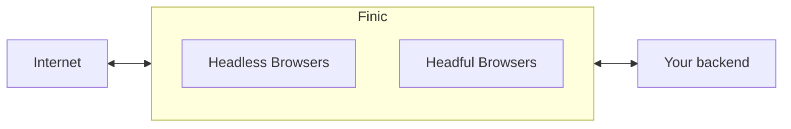

## First Steps

<CardGroup cols={2}>
  <Card
    title="Self Hosting"
    icon="pen-to-square"
    href="https://docs.finic.io/quickstart"
  >
    Run the Finic Chrome image locally or deploy it to your cloud.
  </Card>
</CardGroup>

Finic provides browser infrastructure for developers building web scrapers, browser automations, and AI agents. It does this by giving you a browser in the cloud you can control remotely using Playwright or Puppeteer (in just a few lines), 
or Selenium (with some work).

Finic lets you focus on the **automation logic** while delegating **browser and network level infrastructure** to us.


### Why might you need this?
Normally, when you deploy a web automation, it launches a fresh headless browser in the same container your code is running. This works for simple use cases, but can become unwieldy as you scale. 
Chromium is memory intensive and requires constant monitoring to make sure it doesn't crash, especially with multiple automations running in the same container. 

Modern CDNs also employ a dizzying array of strategies for detecting and blocking bots you'll need to contend with. For example:
- **IP address monitoring**
- **HTTP header analysis**
- **Browser fingerprinting based on user agent, installed fonts, cookies, etc**
- **Device telemetry if available**
- **Interactive and invisble Captcha challenges**

Rather than implement features to circumvent these detectors, it's much easier to connect to a managed browser instance like Finic that takes care of **scaling** and
**stealth** for you.

### Benefits
Finic's Browser Service let you decouple your automation code from the code that runs the browser.

This has several benefits:
- **You get a browser in the cloud that "just works"** and doesn't require any configuration
- You can deploy to services like Lambda or Cloud Functions without worrying about image sizes, resource allocation, or network configuration
- You benefit from reliability improvements without having to update your code or your dependencies
- Debugging is straightforward since you can immediately tell if an error was due to the browser being blocked (our fault) or your code (your fault)

Adding Finic to an existing project is easy - just pass in our browser's URL when launching a new browser in Playwright.

All you have to do is replace this:
```python
browser = playwright.chromium.launch(headless=False)
```
with this:
```
browser = playwright.chromium.connect_over_cdp("ws://browser.finic.io/?apikey=<your-finic-api-key>")
```

If you're self hosting, simply replace the `cdp_url` with the url of the Finic instance running on your own server.

##  Planned Features
- Reverse proxies
- Captcha solving
- Computer vision based selectors
- Interactive sessions for human-in-the-loop handoffs
- Session recordings
