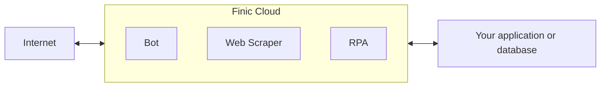

Finic is a cloud platform designed to simplify the deployment and management of browser-based automation agents, with a focus on fault-tolerant execution.
It's designed for quickly launching AI bots, web scrapers, API integrations, and other jobs that depend on web services which are unreliable, not optimized for machine consumption, or both.

## Why Finic?
Finic lets you focus on building powerful web automations without dealing with the complexities of cloud deployment, monitoring, error hanlding, and secret management.

- **Cloud Deployment**: Deploy to Finic Cloud with a single command. Sync to your GitHub repo to automate builds.
- **Secure Credential Management**: Safely store and access secrets for your agents using Finic's built-in secret manager.
- **Fault Tolerance**: Agents automatically recover from timeouts, errors, and other transient network issues.
- **Monitoring and Logging**: Track agent execution and view detailed logs through the Finic dashboard.
- **Scalability**: Automatically scale your automation workflows as your needs grow, without managing infrastructure.

Finic is an unopinionated framework, so you can build agents using your preferred tools and practices.

## First Steps

Deploy your first web agent to the cloud.

<CardGroup cols={2}>
  <Card
    title="Quickstart"
    icon="pen-to-square"
    href="https://finic.ai/docs/quickstart"
  >
    Install Finic, create a boilerplate project, deploy it to the cloud, and trigger it.
  </Card>
  <Card
    title="Local Development"
    icon="image"
    href="https://finic.ai/docs/development"
  >
    How to develop locally and add Finic to existing projects.
  </Card>
</CardGroup>

## Roadmap
- Automated deployment from GitHub.
- Webhooks to nofify you when agents have finished running or failed.
- Containers with X11 installed for advanced UI automation.
- Session impersonation - sync session tokens to the secret manager so your agents can use them.
- Self healing selectors - use LLMs to propose code fixes when the content changes on target websites.
- Scheduling and orchestration features to define workflows composed of multiple agents.
- Automatically detect rate limits and back off to maximize throughput.
- Set custom timeouts with no upper bound, useful for long running tasks or always-on agents.